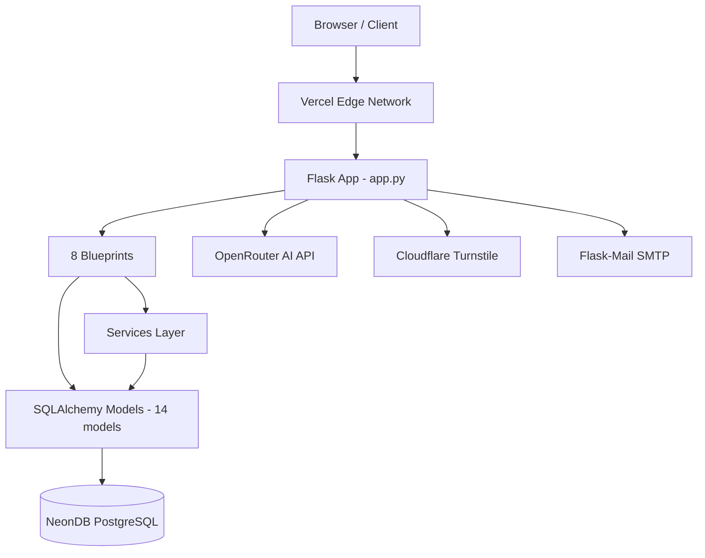
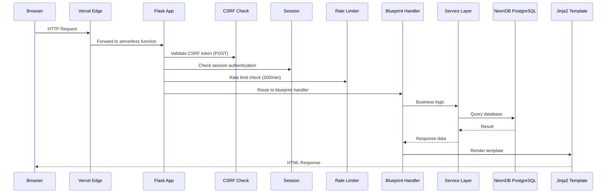

<!--
DOCUMENT METADATA
Owner: @systems-architect
Update trigger: Thay đổi kiến trúc hệ thống, thêm integration, thay đổi stack
Update scope: Toàn bộ tài liệu
Read by: Tất cả team members. Đọc trước khi đưa ra quyết định kiến trúc.
-->

# Kiến trúc hệ thống (System Architecture)

> **Last updated**: 2026-04-14
> **Version**: 2.0.0 (NeonDB + Vercel)

---

## Tổng quan (Overview)

MindGuard là nền tảng nâng cao nhận thức phòng chống lừa đảo trực tuyến cho người dùng Việt Nam. Hệ thống cung cấp *quiz* tương tác, *chatbot* AI hướng dẫn, và hệ thống báo cáo *scammer* có kiểm duyệt cộng đồng.

Ứng dụng là một *modular monolith* Flask được deploy dưới dạng *serverless function* trên Vercel. Frontend sử dụng *server-side rendering* với Jinja2 + Bootstrap 5. Dữ liệu lưu trên NeonDB PostgreSQL (*serverless* PostgreSQL). Các dịch vụ bên ngoài bao gồm OpenRouter (AI), Cloudflare Turnstile (CAPTCHA), và Flask-Mail (OTP).

Kiến trúc được thiết kế đơn giản có chủ đích: một *monolith* có ranh giới nội bộ rõ ràng (*blueprints*, *services*, *utils*), đủ linh hoạt để tách module nếu cần mở rộng.

### Sơ đồ tổng thể (System Overview)



---

## Tech Stack

| Layer | Công nghệ | Version | Lý do chọn |
|-------|-----------|---------|------------|
| Frontend | Jinja2 + Bootstrap 5 | Flask 3.0.3 built-in | *Server-side rendering*, không cần build step |
| Styling | Bootstrap 5 + Custom CSS | 5.x | Phát triển UI nhanh, *responsive* sẵn |
| Backend | Python + Flask | 3.12.10 / 3.0.3 | Nhẹ, dễ học, hệ sinh thái lớn |
| Database | NeonDB PostgreSQL | 15 (*serverless*) | *Serverless* PostgreSQL, tương thích Vercel, không cần quản lý server |
| ORM | Flask-SQLAlchemy | 3.1.1 | ORM Pythonic, tích hợp chặt với Flask |
| Auth | Flask *sessions* + Werkzeug | 3.0.3 | *Password hashing* + *session management* tích hợp sẵn |
| AI | OpenRouter API | Latest | Truy cập nhiều *model* LLM miễn phí (Liquid, Gemini, Molmo) |
| Anti-Bot | Cloudflare Turnstile | Latest | CAPTCHA miễn phí, tôn trọng quyền riêng tư |
| Email | Flask-Mail | 0.9.1 | Gửi OTP và thông báo |
| Rate Limiting | Flask-Limiter | Latest | Giới hạn *request* theo IP, mặc định 200/phút |
| CSRF | Flask-WTF CSRFProtect | Latest | Bảo vệ *form* khỏi tấn công *CSRF* |
| Hosting | Vercel | Latest | *Serverless deployment*, CDN tích hợp, CI/CD tự động |

---

## Các thành phần hệ thống (System Components)

### Frontend Architecture

Frontend sử dụng *server-side rendering* với Jinja2 *templates* và Bootstrap 5. Toàn bộ HTML được tạo trên server — không có SPA *framework*, không có *client-side routing*, không cần *build step*.

**Routing**: Flask *blueprints* định nghĩa tất cả *routes* phía server. Mỗi *blueprint* tương ứng một nhóm chức năng (auth, quiz, chatbot, v.v.).

**Template hierarchy**: Tất cả *page templates* kế thừa từ `templates/base.html` (cung cấp HTML shell, navigation, footer). Các *templates* nằm phẳng trong `templates/` (không có thư mục con theo *blueprint*).

**Client-side JavaScript**: Sử dụng hạn chế cho các tính năng cần tương tác động:
- *Quiz flow* (câu hỏi có giới hạn thời gian, submit đáp án)
- Giao diện *chatbot* (gửi/nhận tin nhắn)
- Hiệu ứng *leaderboard*
- *Form validation* và tích hợp CAPTCHA

**Styling**: Bootstrap 5 utility classes kết hợp custom CSS trong `static/css/`. Không có CSS preprocessor hay build pipeline.

---

### Backend Architecture

Backend là Flask application tổ chức theo *blueprints*, với *services layer* cho logic nghiệp vụ và *utils layer* cho các tiện ích dùng chung.

**API style**: Chủ yếu trả HTML *server-rendered*. *Blueprint* `api` cung cấp một số JSON *endpoints* cho JavaScript phía client (chatbot, tìm kiếm scammer). Một số *routes* trong các *blueprints* khác (chatbot, scammer) cũng trả JSON.

**Tổ chức *Blueprint*** (route layer):

```
routes/
  main.py        # Trang chủ, thống kê, bảng xếp hạng, tìm kiếm
  auth.py        # Đăng nhập, đăng ký, OTP, profile
  quiz.py        # Luồng quiz, câu hỏi AI
  scammer.py     # Báo cáo lừa đảo, theo dõi scammer
  chatbot.py     # Giao diện chatbot AI
  admin.py       # Dashboard admin, kiểm duyệt
  library.py     # Thư viện kiến thức
  api.py         # JSON API endpoints (public)
```

**Middleware / request pipeline**:
1. **Security headers** — `X-Frame-Options`, `X-Content-Type-Options`, `X-XSS-Protection`, `Referrer-Policy`, `Permissions-Policy` (đặt trong `app.py` `@app.after_request`)
2. **CSRF protection** — Flask-WTF `CSRFProtect` bảo vệ mọi POST *form*
3. **Flask *session*** — xác thực người dùng qua *session cookie* (cookie-based, signed)
4. **Rate limiting** — Flask-Limiter mặc định 200 *request*/phút theo IP, có *per-route limits* cho các *routes* nhạy cảm
5. **Cloudflare Turnstile** — xác thực server-side trên *forms* đăng ký, báo cáo
6. **Anti-spam** — đánh giá rủi ro đa tín hiệu (account + cookie + IP) với trọng số cấu hình

**Services layer** (`services/`): Logic nghiệp vụ phức tạp:
- `anti_spam.py` — rate limiting đa tín hiệu và chấm điểm rủi ro
- `leaderboard_integrity.py` — tính toán và xác minh bảng xếp hạng
- `sensitive_access_log.py` — audit trail cho admin operations
- `admin_guard.py` — bảo vệ tài khoản admin (suspend/unsuspend)

**Utils layer** (`utils/`): Tiện ích dùng chung:
- `ai_agent.py` — OpenRouter API client cho tương tác AI
- `chatbot.py` — format tin nhắn, quản lý *conversation*
- `encryption.py` — mã hóa/giải mã dữ liệu nhạy cảm
- `helpers.py` — thuật toán chấm điểm rủi ro, tính *badge*
- `privacy_policy.py` — ẩn PII (số điện thoại, email, CCCD)
- `quiz_data.py` — ngân hàng câu hỏi và cấu hình quiz

**Configuration**: `config.py` chứa cài đặt ứng dụng. *Extensions* (SQLAlchemy, Mail, Limiter, CSRF) khởi tạo trong `extensions.py` và đăng ký với app trong `app.py`.

---

### Hạ tầng (Infrastructure)

**Môi trường triển khai**:

| Môi trường | URL | Ghi chú |
|------------|-----|---------|
| Production | `https://mindguard-five.vercel.app` | Vercel *serverless*, auto-deploy từ `main` branch |
| Local | `http://localhost:5000` | `python app.py`, Flask development server |

**Vercel *serverless* deployment**:
- Flask app chạy dưới dạng *serverless function* (cấu hình trong `vercel.json`)
- *Filesystem* read-only — file tạm chỉ ghi được vào `/tmp`
- *Cold start* khoảng 1-3 giây cho lần khởi động đầu tiên
- Logs xem qua Vercel Dashboard > Functions > Logs

**CI/CD**: Chưa cấu hình GitHub Actions. Hiện tại deploy tự động qua Vercel khi push lên `main`.

---

## Vòng đời Request (Request Lifecycle)



> **Ghi chú**: Với JSON *endpoints* (chatbot, api), bước render Jinja2 được thay bằng `jsonify()` trả JSON trực tiếp.

---

## Luồng dữ liệu (Data Flow)

### Luồng xác thực (Authentication Flow)

1. Người dùng truy cập `/register` → nhập email + mật khẩu → CAPTCHA Turnstile xác thực
2. Server tạo bản ghi `Registration` (mật khẩu *hash* bằng Werkzeug PBKDF2-SHA256)
3. OTP gửi qua Flask-Mail → người dùng nhập OTP tại `/verify-otp`
4. Xác thực thành công → `session['registration_email']` được đặt → chuyển đến *onboarding*
5. Các *route* được bảo vệ kiểm tra `session` qua `@login_required` *decorator*
6. Admin đăng nhập riêng tại `/admin/login` → `session['is_admin']` = True

### Luồng Quiz

1. Người dùng chọn danh mục tại `/quiz` → bắt đầu phiên quiz
2. AI sinh câu hỏi qua OpenRouter API (hoặc dùng ngân hàng câu hỏi tĩnh nếu API lỗi)
3. Trả lời từng câu tại `/quiz/step/<idx>` → đáp án lưu trong `session`
4. Hoàn thành → `/quiz/finalize` tính điểm → lưu `QuizResult` vào database
5. Kết quả hiển thị tại `/quiz/result` → đạt ≥75% nhận chứng nhận tại `/certificate`

### Luồng báo cáo Scammer

1. Người dùng truy cập `/scammer/report` → nhập thông tin scammer + bằng chứng
2. CAPTCHA Turnstile xác thực → Anti-spam kiểm tra rủi ro đa tín hiệu (IP, cookie, account)
3. Nếu vượt *threshold* → cooldown, thông báo cho người dùng
4. Nếu hợp lệ → lưu `ScammerReport` + cập nhật `ScamReport` (thông tin scammer tổng hợp)
5. Danh tính người báo cáo được *hash* → Admin kiểm duyệt tại `/admin/scammer-reports`
6. Admin duyệt/từ chối → cập nhật trạng thái, ảnh hưởng *leaderboard*

### Luồng AI Chatbot

1. Người dùng truy cập `/chatbot/` → hiển thị danh sách *session* cũ hoặc tạo mới
2. Gửi tin nhắn qua `/chatbot/send` (POST, JSON)
3. Server gửi *prompt* (system prompt + lịch sử chat + tin nhắn mới) đến OpenRouter API
4. **Timeout 8 giây** (xem [ADR-004](DECISIONS.md)) — nếu quá hạn, trả *fallback* tĩnh
5. **Hard-block**: Từ chối trả lời chủ đề nhạy cảm (chính trị, tôn giáo, tự hại)
6. Phản hồi AI lưu vào `AIChatMessage` → hiển thị cho người dùng

---

## Hệ thống thiết kế (Design System)

MindGuard sử dụng Bootstrap 5 *utility classes* kết hợp custom CSS — chưa có formal *design token* system.

- **Styles**: Xem `static/css/` cho các file CSS custom
- **JavaScript**: Xem `static/js/` cho các file JS custom
- **Light mode**: Giao diện light mode thống nhất trên toàn bộ trang (triển khai ở v1.0 Phase 3)

---

## Kiến trúc bảo mật (Security Architecture)

**Mô hình xác thực**: Flask *server-side sessions* với Werkzeug *password hashing*. Người dùng xác thực qua email/mật khẩu; *sessions* được quản lý qua *cookie* có chữ ký (cookie-based, signed bằng `SECRET_KEY`). OTP gửi qua Flask-Mail để xác thực đăng ký.

**Phân quyền**: Hai vai trò — *user* (đăng nhập qua `session['registration_email']`) và *admin* (đăng nhập qua `session['is_admin']`). *Route decorators* kiểm tra quyền trước khi cho phép truy cập admin-only *endpoints*.

**Bảo vệ dữ liệu**:
- Mật khẩu *hash* bằng Werkzeug `generate_password_hash` (PBKDF2-SHA256)
- PII nhạy cảm (số điện thoại, email, CCCD) ẩn qua `privacy_policy.py` trong *views* công khai
- Mã hóa dữ liệu nhạy cảm bằng `encryption.py` (sử dụng `REPORT_ENCRYPTION_KEY`)
- Danh tính người báo cáo scammer được *hash* để bảo vệ ẩn danh

**Chống spam và bot**:
- **Anti-spam đa tín hiệu** (`anti_spam.py`): chấm điểm rủi ro dựa trên account (70%), cookie (20%), và IP (10%) với cooldown cấu hình được
- **Cloudflare Turnstile** CAPTCHA trên forms đăng ký, báo cáo
- **Flask-Limiter** — mặc định 200 *request*/phút theo IP, *per-route limits* cho *endpoints* nhạy cảm (xem [ADR-005](DECISIONS.md))
- **CSRF protection** — Flask-WTF `CSRFProtect` bảo vệ mọi POST *request*

**Security headers** (đặt trong `app.py`):
- `X-Frame-Options: SAMEORIGIN`
- `X-Content-Type-Options: nosniff`
- `X-XSS-Protection: 1; mode=block`
- `Referrer-Policy: strict-origin-when-cross-origin`
- `Permissions-Policy: geolocation=(), microphone=(), camera=()`

**Audit trail**: `sensitive_access_log.py` ghi lại thao tác admin trên dữ liệu nhạy cảm.

**Quyết định bảo mật chi tiết**: Xem [DECISIONS.md](DECISIONS.md) cho các ADR liên quan.

---

## Cân nhắc hiệu năng (Performance Considerations)

- **Database**: NeonDB PostgreSQL chạy *serverless* — có độ trễ mạng (~50-100ms cho *cold connection*). *Connection pooling* qua NeonDB *built-in pooler*. Hiệu năng tốt cho quy mô hiện tại.
- **AI calls**: OpenRouter API chạy inline trong *request cycle*. *Timeout* 8 giây (xem [ADR-004](DECISIONS.md)). P95 latency phụ thuộc vào *response time* của *model* bên ngoài (thường 2-5 giây). Chưa có *caching layer* cho AI responses.
- **Server-side rendering**: Tất cả trang render server-side qua Jinja2. Không có *hydration* phía client. Thời gian tải trang phụ thuộc vào *query* database cho trang động (*leaderboard*, *scammer profiles*).
- **Vercel *serverless***: *Cold start* 1-3 giây cho lần chạy đầu. Các lần tiếp theo trong cùng *instance* nhanh hơn. *Filesystem* read-only, chỉ `/tmp` ghi được.
- **Static assets**: CSS, JS, hình ảnh serve qua Vercel CDN — tối ưu hơn so với Flask static handler trực tiếp.
- **Anti-spam scoring**: Chấm điểm rủi ro chạy trên mỗi *form submission* nhưng rất nhẹ (tra cứu trong database). Không ảnh hưởng đáng kể đến *latency*.

---

## Hạn chế và nợ kỹ thuật (Known Constraints)

| Hạn chế | Ảnh hưởng | Kế hoạch |
|---------|-----------|----------|
| Vercel *filesystem* read-only | Không ghi file vào disk (logs, uploads) — chỉ dùng `/tmp` (ephemeral) | Dùng `/tmp` cho logs; uploads lưu database hoặc cloud storage |
| Vercel *cold start* | Lần truy cập đầu tiên sau idle chậm 1-3 giây | Chấp nhận — đặc trưng *serverless* |
| AI calls inline (không có *background job*) | OpenRouter API chặn *request thread* 2-8 giây | Xem xét *task queue* nếu cần tối ưu sau |
| Chưa có CI/CD pipeline | Chưa có *automated testing* trên PR | Lên kế hoạch GitHub Actions |
| Chưa có *linter/formatter* | Code style không nhất quán | Xem xét thêm Ruff hoặc Black |
| NeonDB *connection limits* | *Serverless* PostgreSQL có giới hạn *concurrent connections* | Theo dõi usage trên NeonDB Dashboard |
| Chưa có *background job queue* | Quiz AI và chatbot chạy *synchronous* | Xem xét Celery/RQ nếu quy mô tăng |

---

## Xem thêm (See Also)

- [DATABASE.md](DATABASE.md) — Schema database chi tiết (14 bảng, ER diagram)
- [API.md](API.md) — Danh sách đầy đủ tất cả *routes* và *endpoints*
- [DECISIONS.md](DECISIONS.md) — Architecture Decision Records (5 ADRs)
- [CONVENTIONS.md](CONVENTIONS.md) — Quy ước viết tài liệu, thuật ngữ, *redaction rules*
