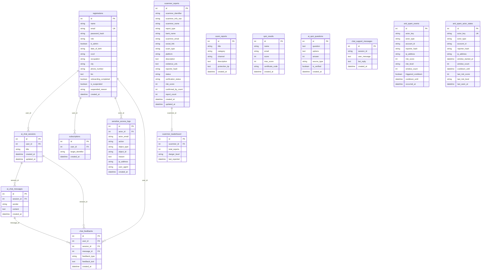

<!--
DOCUMENT METADATA
Owner: @database-expert
Update trigger: Thay đổi schema, thêm/sửa model trong models.py, thêm migration script
Update scope: Cập nhật toàn bộ — bảng, cột, ER diagram
Read by: @backend-developer (viết queries), @systems-architect (scaling decisions), team members mới (onboarding)
-->

# Database Reference

> **Engine**: PostgreSQL 15 (NeonDB serverless)
> **ORM**: SQLAlchemy (via Flask-SQLAlchemy)
> **Connection**: `DATABASE_URL` environment variable (xem `.env.example`)
> **Models source**: `models/models.py`
> **Last updated**: 2026-04-14

---

## Schema Overview

MindGuard sử dụng 14 bảng PostgreSQL, chia thành 6 nhóm domain:

- **Auth & Users** — Quản lý tài khoản người dùng và đăng nhập
- **Quiz** — Kết quả bài kiểm tra nhận thức và câu hỏi AI-generated
- **Scammer Reports** — Báo cáo lừa đảo từ cộng đồng và bảng xếp hạng
- **Chatbot** — Phiên trò chuyện AI, tin nhắn, hỗ trợ nhanh, và góp ý
- **Anti-Spam** — Theo dõi sự kiện spam và trạng thái actor
- **Subscriptions & Audit** — Theo dõi đối tượng và nhật ký truy cập dữ liệu nhạy cảm

**Quan hệ chính**:

- `registrations` là bảng trung tâm — được tham chiếu bởi `ai_chat_sessions`, `subscriptions`, `sensitive_access_logs`, `chat_feedbacks`
- `scammer_reports` → `scammer_leaderboard`: một scammer có một leaderboard entry
- `ai_chat_sessions` → `ai_chat_messages`: một session có nhiều messages (cascade delete)
- `ai_chat_sessions` → `chat_feedbacks`: feedback liên kết về session và message cụ thể

---

## ER Diagram

---

## Tables

### Auth & Users

---

#### registrations

**Mục đích**: Lưu tất cả tài khoản người dùng. Bảng trung tâm cho authentication và profile.

| Column | Type | Constraints | Mô tả |
|--------|------|-------------|-------|
| id | Integer | PK, NOT NULL | Khóa chính |
| name | String(150) | NOT NULL | Tên hiển thị |
| email | String(150) | NOT NULL, UNIQUE | Email đăng nhập |
| password_hash | String(256) | | Mật khẩu đã hash |
| role | String(20) | DEFAULT 'user' | Vai trò: 'user' hoặc 'admin' |
| is_admin | Boolean | DEFAULT false | Cờ admin |
| date_of_birth | String(20) | | Ngày sinh |
| cccd | String(20) | | Số căn cước công dân |
| occupation | String(100) | | Nghề nghiệp |
| city | String(100) | | Thành phố |
| phone_number | String(20) | | Số điện thoại (hiển thị dạng che) |
| bio | Text | | Tiểu sử |
| onboarding_completed | Boolean | DEFAULT false | Đã hoàn thành onboarding |
| is_suspended | Boolean | DEFAULT false | Tài khoản bị đình chỉ |
| suspended_reason | String(255) | | Lý do đình chỉ |
| created_at | DateTime | DEFAULT utcnow | Thời điểm tạo |

**Được tham chiếu bởi**: `ai_chat_sessions.user_id`, `subscriptions.user_id`, `sensitive_access_logs.actor_id`, `chat_feedbacks.user_id`

---

### Quiz

---

#### quiz_results

**Mục đích**: Lưu kết quả bài kiểm tra nhận thức của người dùng và mã chứng nhận.

| Column | Type | Constraints | Mô tả |
|--------|------|-------------|-------|
| id | Integer | PK, NOT NULL | Khóa chính |
| name | String(150) | NOT NULL | Tên người làm bài |
| email | String(150) | | Email người làm bài |
| score | Integer | NOT NULL | Điểm đạt được |
| max_score | Integer | NOT NULL | Điểm tối đa |
| certificate_code | String(20) | | Mã chứng nhận (nếu đạt) |
| created_at | DateTime | DEFAULT utcnow | Thời điểm làm bài |

---

#### ai_quiz_questions

**Mục đích**: Câu hỏi quiz được tạo bởi AI hoặc thêm thủ công, dùng cho bài kiểm tra nhận thức.

| Column | Type | Constraints | Mô tả |
|--------|------|-------------|-------|
| id | Integer | PK, NOT NULL | Khóa chính |
| question | Text | NOT NULL | Nội dung câu hỏi |
| options | Text | NOT NULL | Các lựa chọn (JSON string) |
| answer | Integer | NOT NULL | Index đáp án đúng |
| source_type | String(50) | DEFAULT 'scam_report' | Nguồn tạo câu hỏi |
| is_verified | Boolean | DEFAULT true | Đã được duyệt |
| created_at | DateTime | DEFAULT utcnow | Thời điểm tạo |

**Ghi chú**: `options` lưu dạng JSON array string, parse bằng `json.loads()` trong `to_dict()`.

---

### Scammer Reports

---

#### scam_reports

**Mục đích**: Lưu báo cáo scam tổng quát (dạng bài viết giáo dục, không gắn với đối tượng cụ thể).

| Column | Type | Constraints | Mô tả |
|--------|------|-------------|-------|
| id | Integer | PK, NOT NULL | Khóa chính |
| title | String(200) | NOT NULL | Tiêu đề báo cáo |
| category | String(100) | | Danh mục scam |
| channel | String(100) | | Kênh lừa đảo |
| description | Text | NOT NULL | Chi tiết mô tả |
| protection_tip | Text | | Mẹo phòng tránh |
| created_at | DateTime | DEFAULT utcnow | Thời điểm tạo |

---

#### scammer_reports

**Mục đích**: Báo cáo đối tượng lừa đảo cụ thể từ cộng đồng. Bảng chính của hệ thống reporting.

| Column | Type | Constraints | Mô tả |
|--------|------|-------------|-------|
| id | Integer | PK, NOT NULL | Khóa chính |
| scammer_identifier | String(200) | NOT NULL | Định danh đối tượng (SĐT/STK/email) |
| scammer_info_raw | String(200) | | Thông tin gốc chưa xử lý |
| scammer_name | String(200) | | Tên đối tượng |
| report_type | String(50) | DEFAULT 'general' | Loại báo cáo |
| bank_name | String(100) | | Tên ngân hàng (nếu lừa đảo tài chính) |
| scammer_email | String(100) | | Email đối tượng |
| social_link | String(200) | | Link mạng xã hội |
| scam_type | String(100) | NOT NULL | Loại lừa đảo |
| platform | String(100) | | Nền tảng xảy ra |
| description | Text | NOT NULL | Mô tả chi tiết |
| evidence_urls | Text | | URLs bằng chứng |
| reporter_hash | String(64) | NOT NULL | Hash của người báo cáo (bảo vệ danh tính) |
| status | String(20) | DEFAULT 'pending' | Trạng thái: pending/approved/rejected |
| verification_status | String(20) | DEFAULT 'unverified' | unverified/pending/verified |
| risk_score | Integer | DEFAULT 0 | Điểm rủi ro 0-100 |
| confirmed_by_count | Integer | DEFAULT 0 | Số người xác nhận |
| report_count | Integer | DEFAULT 1 | Số lần bị báo cáo |
| created_at | DateTime | DEFAULT utcnow | Thời điểm tạo |
| updated_at | DateTime | DEFAULT utcnow, ON UPDATE | Thời điểm cập nhật |

**Được tham chiếu bởi**: `scammer_leaderboard.scammer_id`

---

#### scammer_leaderboard

**Mục đích**: Bảng xếp hạng scammer bị báo cáo nhiều nhất, dùng cho trang leaderboard công khai.

| Column | Type | Constraints | Mô tả |
|--------|------|-------------|-------|
| id | Integer | PK, NOT NULL | Khóa chính |
| scammer_id | Integer | FK → scammer_reports.id, NOT NULL | Liên kết đối tượng |
| total_reports | Integer | DEFAULT 0 | Tổng số báo cáo |
| danger_level | String(20) | DEFAULT 'low' | Mức nguy hiểm: low/medium/high |
| last_reported | DateTime | DEFAULT utcnow | Lần báo cáo gần nhất |

**Quan hệ**: `scammer` → `ScammerReport` (backref: `leaderboard_entry`)

---

### Chatbot

---

#### ai_chat_sessions

**Mục đích**: Phiên trò chuyện AI của người dùng đã đăng nhập. Mỗi user có nhiều sessions.

| Column | Type | Constraints | Mô tả |
|--------|------|-------------|-------|
| id | Integer | PK, NOT NULL | Khóa chính |
| user_id | Integer | FK → registrations.id, NOT NULL | Người dùng sở hữu session |
| title | String(100) | DEFAULT 'Cuộc trò chuyện mới' | Tiêu đề session |
| created_at | DateTime | DEFAULT utcnow | Thời điểm tạo |
| updated_at | DateTime | DEFAULT utcnow, ON UPDATE | Thời điểm cập nhật |

**Quan hệ**: `messages` → `AiChatMessage[]` (cascade delete-orphan)

---

#### ai_chat_messages

**Mục đích**: Tin nhắn trong phiên trò chuyện AI. Lưu cả tin nhắn user và bot.

| Column | Type | Constraints | Mô tả |
|--------|------|-------------|-------|
| id | Integer | PK, NOT NULL | Khóa chính |
| session_id | Integer | FK → ai_chat_sessions.id, NOT NULL | Phiên trò chuyện |
| sender | String(20) | NOT NULL | 'user' hoặc 'bot' |
| content | Text | NOT NULL | Nội dung tin nhắn |
| created_at | DateTime | DEFAULT utcnow | Thời điểm gửi |

---

#### chat_support_messages

**Mục đích**: Tin nhắn hỗ trợ nhanh (chat bubble) — dành cho người dùng chưa đăng nhập hoặc support flow đơn giản.

| Column | Type | Constraints | Mô tả |
|--------|------|-------------|-------|
| id | Integer | PK, NOT NULL | Khóa chính |
| session_id | String(100) | NOT NULL | ID session (client-generated) |
| user_message | Text | NOT NULL | Tin nhắn người dùng |
| bot_reply | Text | | Phản hồi chatbot |
| created_at | DateTime | DEFAULT utcnow | Thời điểm gửi |

---

#### chat_feedbacks

**Mục đích**: Góp ý và báo cáo sai từ người dùng về câu trả lời chatbot. Dùng để thu thập dữ liệu tinh chỉnh.

| Column | Type | Constraints | Mô tả |
|--------|------|-------------|-------|
| id | Integer | PK, NOT NULL | Khóa chính |
| user_id | Integer | FK → registrations.id | Người góp ý (nullable — có thể anonymous) |
| session_id | Integer | FK → ai_chat_sessions.id | Phiên liên quan |
| message_id | Integer | FK → ai_chat_messages.id | Tin nhắn được góp ý |
| feedback_type | String(30) | NOT NULL | Loại: 'incorrect', 'offensive', 'unclear', 'other' |
| feedback_text | Text | | Nội dung góp ý chi tiết |
| created_at | DateTime | DEFAULT utcnow | Thời điểm gửi |

---

### Anti-Spam

---

#### anti_spam_events

**Mục đích**: Ghi lại từng sự kiện spam detection. Dùng cho telemetry và phân tích hành vi.

| Column | Type | Constraints | Mô tả |
|--------|------|-------------|-------|
| id | Integer | PK, NOT NULL | Khóa chính |
| actor_key | String(128) | NOT NULL, INDEX | Khóa định danh actor (IP hoặc account hash) |
| actor_type | String(20) | NOT NULL | Loại actor: 'ip', 'account', 'cookie' |
| account_id | String(64) | | ID tài khoản (nếu đã đăng nhập) |
| reporter_hash | String(64) | | Hash người báo cáo |
| ip_address | String(45) | | Địa chỉ IP |
| risk_score | Integer | NOT NULL, DEFAULT 0 | Điểm rủi ro tính toán |
| risk_level | String(10) | NOT NULL, DEFAULT 'low' | Mức rủi ro: low/medium/high |
| window_count | Integer | NOT NULL, DEFAULT 1 | Số lần trong cửa sổ thời gian |
| triggered_cooldown | Boolean | NOT NULL, DEFAULT false | Đã kích hoạt cooldown |
| cooldown_until | DateTime | | Thời điểm hết cooldown |
| occurred_at | DateTime | NOT NULL, DEFAULT utcnow | Thời điểm sự kiện |

**Indexes**: `actor_key` (B-tree)

---

#### anti_spam_actor_states

**Mục đích**: Trạng thái hiện tại của mỗi actor trong hệ thống anti-spam. Cập nhật liên tục.

| Column | Type | Constraints | Mô tả |
|--------|------|-------------|-------|
| id | Integer | PK, NOT NULL | Khóa chính |
| actor_key | String(128) | NOT NULL, UNIQUE, INDEX | Khóa định danh actor |
| actor_type | String(20) | NOT NULL | Loại actor |
| account_id | String(64) | | ID tài khoản |
| reporter_hash | String(64) | | Hash người báo cáo |
| ip_address | String(45) | | Địa chỉ IP |
| window_started_at | DateTime | | Bắt đầu cửa sổ đếm |
| window_count | Integer | NOT NULL, DEFAULT 0 | Số lần trong cửa sổ hiện tại |
| cooldown_until | DateTime | | Thời điểm hết cooldown |
| last_risk_score | Integer | NOT NULL, DEFAULT 0 | Điểm rủi ro gần nhất |
| last_risk_level | String(10) | NOT NULL, DEFAULT 'low' | Mức rủi ro gần nhất |
| last_seen_at | DateTime | NOT NULL, DEFAULT utcnow | Lần hoạt động gần nhất |

**Indexes**: `actor_key` (B-tree, UNIQUE)

---

### Subscriptions & Audit

---

#### subscriptions

**Mục đích**: Theo dõi đối tượng lừa đảo — người dùng subscribe để nhận thông báo khi có báo cáo mới.

| Column | Type | Constraints | Mô tả |
|--------|------|-------------|-------|
| id | Integer | PK, NOT NULL | Khóa chính |
| user_id | Integer | FK → registrations.id, NOT NULL | Người theo dõi |
| target_identifier | String(200) | NOT NULL | Định danh đối tượng được theo dõi |
| created_at | DateTime | DEFAULT utcnow | Thời điểm subscribe |

---

#### sensitive_access_logs

**Mục đích**: Nhật ký kiểm toán khi admin hoặc hệ thống truy cập dữ liệu nhạy cảm (SĐT, CCCD, thông tin cá nhân).

| Column | Type | Constraints | Mô tả |
|--------|------|-------------|-------|
| id | Integer | PK, NOT NULL | Khóa chính |
| actor_id | Integer | FK → registrations.id | Người thực hiện (nullable — system actions) |
| actor_email | String(150) | NOT NULL | Email người thực hiện |
| action | String(20) | NOT NULL | Hành động: 'view', 'export', 'unmask' |
| object_type | String(100) | NOT NULL | Loại đối tượng truy cập |
| object_id | String(100) | NOT NULL | ID đối tượng |
| reason | Text | | Lý do truy cập |
| ip_address | String(45) | | Địa chỉ IP |
| user_agent | String(512) | | User agent trình duyệt |
| created_at | DateTime | NOT NULL, DEFAULT utcnow | Thời điểm truy cập |

---

## Ghi chú kỹ thuật

- **ORM**: Tất cả models định nghĩa trong `models/models.py`, import `db` từ `extensions.py`
- **Migration**: Dùng manual scripts trong `database/` (không dùng flask-migrate/Alembic)
- **Connection pooling**: `pool_pre_ping=True`, `sslmode=require` cho NeonDB
- **Timestamps**: Tất cả dùng `datetime.utcnow` — lưu ý UTC, không phải local timezone
- **Cascade**: `ai_chat_messages` cascade delete khi xóa session (`delete-orphan`)
- **Soft delete**: Không sử dụng — tài khoản bị đình chỉ qua cờ `is_suspended`
